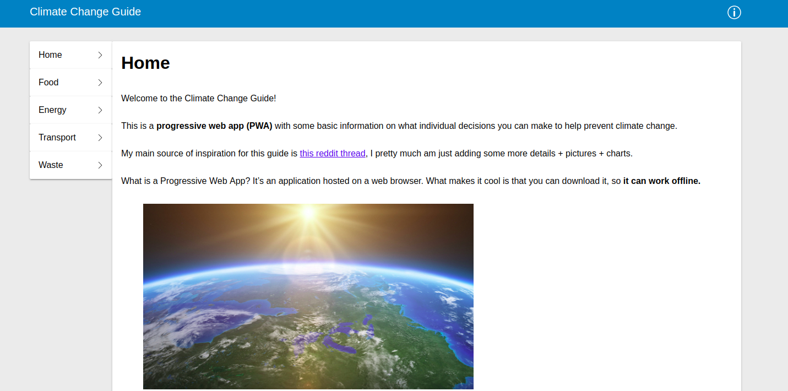
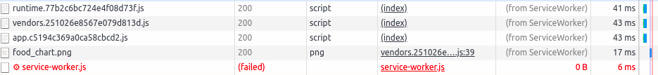
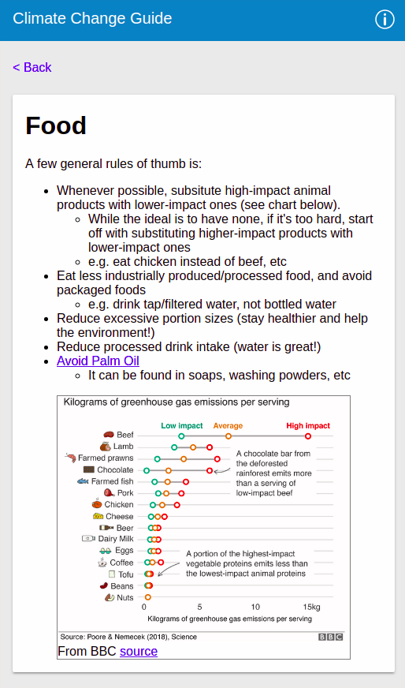

# Climate Change Progressive Web App

A basic Progressive Web App learning project I'm making for myself, just to get familiar with service workers.



### Mobile first and Offline first




## Tools used + implementation details

- Webpack 4 - configured with 3 webpack config files
  - `webpack.common.config` - holds the loaders/plugins used in both dev and prod builds
  - `webpack.dev.config.js` - sets node ENV var to development, for local dev environment
  - `webpack.prod.config.js` - sets up workbox plugin, configure it to cache static assets, webpack-bundled js files, etc
    - static assets stored in `/static/`
- React.js - configured as an Single-Page App (SPA), entry file is `/app/app.jsx`
  - webpack configured to alias component directories for easier importing when building out components
    - reusable presentational components in `app/Components/Presentation`
    - "Pages" (called "views" in frameworks such as rails etc) - in `/app/Components/Views`
  - jsconfig.json (for VSCode only) - allows for autocomplete for these aliased paths

## Project Setup

First install dependencies with `npm install`

`npm run dev`

Runs the app in development mode via webpack-dev-server, does not register service worker

`npm run build`

generates a prod build in the `/build` directory, w/ an auto-generated `service-worker.js`

`npm run prod:local`

generates a prod build, and runs a local http-server (on port 8080) that services the app. It does properly create a service-worker.js, does not hot reload or recompile on changes, you need to rerun build if there are changes made

### License

```
MIT License

Copyright (c) [2019]

Permission is hereby granted, free of charge, to any person obtaining a copy
of this software and associated documentation files (the "Software"), to deal
in the Software without restriction, including without limitation the rights
to use, copy, modify, merge, publish, distribute, sublicense, and/or sell
copies of the Software, and to permit persons to whom the Software is
furnished to do so, subject to the following conditions:

The above copyright notice and this permission notice shall be included in all
copies or substantial portions of the Software.

THE SOFTWARE IS PROVIDED "AS IS", WITHOUT WARRANTY OF ANY KIND, EXPRESS OR
IMPLIED, INCLUDING BUT NOT LIMITED TO THE WARRANTIES OF MERCHANTABILITY,
FITNESS FOR A PARTICULAR PURPOSE AND NONINFRINGEMENT. IN NO EVENT SHALL THE
AUTHORS OR COPYRIGHT HOLDERS BE LIABLE FOR ANY CLAIM, DAMAGES OR OTHER
LIABILITY, WHETHER IN AN ACTION OF CONTRACT, TORT OR OTHERWISE, ARISING FROM,
OUT OF OR IN CONNECTION WITH THE SOFTWARE OR THE USE OR OTHER DEALINGS IN THE
SOFTWARE.
```
